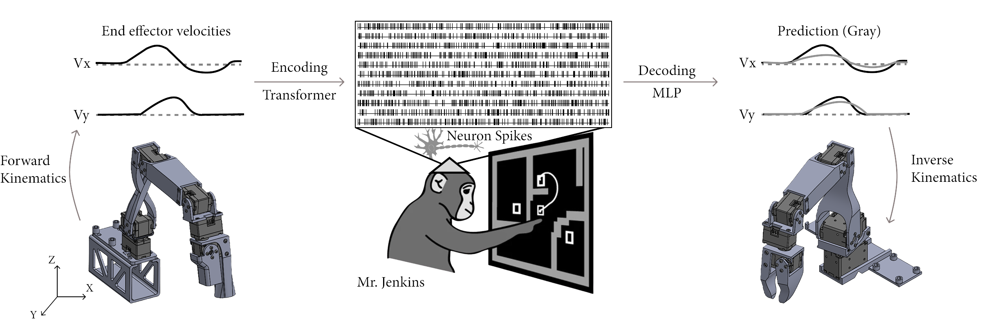

# Project Jenkins: Monkey Thinks, Robot Moves... and Back?
[](https://808robots.com/projects/jenkins)

Project Jenkins explores how neural activity in the brain can be translated into robotic movement and, conversely, how movement patterns can be used to reconstruct brain activity. Using real neural data recorded from a macaque monkey named Jenkins, we develop models for decoding (converting brain signals into robotic arm movements) and encoding (simulating brain activity with a given movement).
For the interface between the brain simulation and the physical world, we utilized [Koch v1.1](https://github.com/jess-moss/koch-v1-1) leader and follower robotic arms. We developed an interactive web console that allows users to generate synthetic brain data from joystick movements in real time.
Our results are a step towards brain-controlled robotics, prosthetics, and enhancing normal motor function. By accurately modeling brain activity, we take a step toward flexible brain-computer interfaces that generalize beyond predefined movements.

🔗 [Visit the full project page](https://808robots.com/projects/jenkins) for more details, videos, and interactive demos.

## Environment Setup

Optionally, create a virtual environment:

```
python -m venv .venv
source .venv/bin/activate
pip install --upgrade pip
```

To start working with the project, install dependencies:

In case you are working with Nvidia RTX5080, install PyTorch form the latest nightly build:

```
pip install --pre torch torchvision torchaudio --index-url https://download.pytorch.org/whl/nightly/cu128
```

otherwise, just install normal PyTorch

```
pip install torch torchvision
```

And then install the rest of the libraries:

```
pip install "numpy<2.0" dandi pynwb h5py matplotlib scikit-learn pygame dynamixel_sdk ikpy psutil ipykernel
```

## Data Download

Then, download the dataset from Churchland et al. (https://dandiarchive.org/dandiset/000070):

```
python jenkins_data_download.py
```

## Model Visualization and Main Script

To visualize the encoder, run the following Jupyter notebook: `encoder_visualize.ipynb`; to visualize the decoder, run the following Jupyter notebook: `decoder_visualize.ipynb`.

To run the main script, with the full pipeline, run the following command:
```
python jenkins_main.py
```

## Model Training

To train the models, move all the files from the `model_training` directory to the root directory and run the following to train a transformer model which generates brain activity from hand velocity:
```
python encoder_train.py --model_type transformer --d_model 256 --lr 0.0005
```
This command will train the model for 400 epochs and save the model in the `model_data` directory. You can then copy the weights to the root directory and name them `encoder_transformer.pt`.

To train the model that generates hand velocity from brain activity, run the following Jupyter notebook:
```
jupyter decoder_train.ipynb
```


